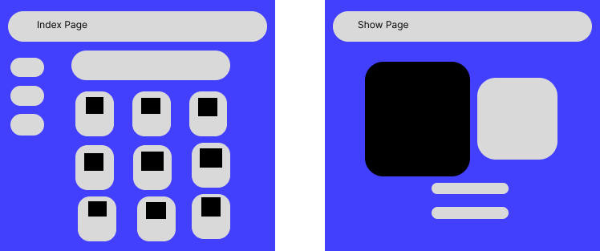

# Meme Marketplace

## Table of Contents
* Introduction
* Installation

## Introduction
Meme Marketplace is a web application created as an online store to buy memes. This react application was built using mongoose, express and mongodb as the database.

 ## Installation

 >npm i express mongoose method-override react-dom

